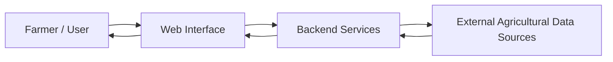

# 🌾 FarmUp – Smart Agriculture Support Platform

FarmUp is a smart agriculture support platform designed to help farmers make **timely, informed, and data-driven decisions** for everyday farming operations. The platform simplifies access to critical agricultural insights, enabling better planning, reduced risk, and improved productivity.

🔗 **Live Application:** https://farmmup.netlify.app/

---

## 🎯 Project Objective

To empower farmers with **actionable insights** that improve decision-making around weather-dependent and operational farming activities, while keeping the experience simple, accessible, and practical for real-world use.

---

## 🚜 Problem Statement

Farmers often face challenges such as:
- Unpredictable weather conditions  
- Lack of timely and reliable information  
- Dependence on guesswork for planning critical operations  
- Limited access to digital farming tools  

These issues can lead to crop loss, inefficient resource usage, and reduced yield.

---

## 🌱 Solution Overview

FarmUp addresses these challenges by providing:
- Timely agricultural insights in a centralized platform  
- A farmer-friendly interface that removes technical complexity  
- Decision-support tools that help reduce uncertainty and risk  

The platform is designed to bridge the gap between traditional farming practices and modern digital solutions.

---

## 🏗️ System Architecture

**Flow Explanation:**
1. Farmers interact with the platform through a web interface  
2. Requests are processed by the backend services  
3. Relevant external agricultural data is fetched and processed  
4. Clean, actionable insights are delivered back to the user  

---

## ✨ Key Features

- 🌦️ Real-time agricultural insights  
- 📊 Decision-support utilities for farm planning  
- 🧑‍🌾 Farmer-centric and easy-to-use interface  
- 🌍 Web-based accessibility for wider reach  

---

## 📈 Impact & Benefits

- **Improved Planning:** Helps farmers schedule sowing, irrigation, and harvesting more effectively  
- **Risk Mitigation:** Reduces crop loss through proactive decision-making  
- **Efficiency:** Encourages optimal use of resources like water and time  
- **Accessibility:** Makes digital farming tools usable without technical expertise  

---

## 🚀 Future Enhancements

- Crop and soil-based recommendations  
- Smart irrigation and water management guidance  
- Yield prediction and seasonal planning tools  
- Multilingual support for regional adoption  
- Advanced analytics for long-term farm optimization  

---

## 🧠 Resume Highlights (Key Takeaways)

- Designed and implemented an **end-to-end agriculture support system**  
- Focused on **real-world problem solving for farmers**  
- Applied **data-driven decision support concepts**  
- Delivered a **production-ready web application** with live deployment  
- Emphasized usability, scalability, and real-life applicability  

---

---

**FarmUp aims to empower farmers with clarity, confidence, and smarter decision-making through accessible digital solutions.**
